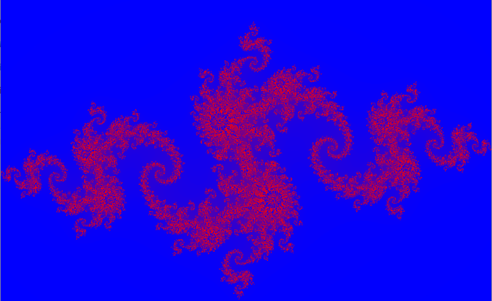

1. define height and width of the image   
2. define complex plane bounds (xmin = -1.5 and xmax = 1.5, ymin = -1.5, ymax =1.5 )  
3. Max iterations = 200  
4. Device function Julia input x,y, width and height, maps to (real,imaginary)
 run Julia fractal (z = z*z + c) until escape/max iteration, return iteration count  
5. Kernel function -> compute iteration count using the device function and assign colour.  
6. main function define the number of threads, grids and launch the kernel  

The background is the iterations that escaped the julia set.  
The design happens when the pixels dont escape.  

Global Image (6x6 pixels):  

P00 P01 P02 P03 P04 P05  
P10 P11 P12 P13 P14 P15  
P20 P21 P22 P23 P24 P25  
P30 P31 P32 P33 P34 P35  
P40 P41 P42 P43 P44 P45  
P50 P51 P52 P53 P54 P55  

Block(0,0): covers pixels  
P00 P01  
P10 P11  

Block(1,0): covers pixels  
P02 P03  
P12 P13  

Block(2,0): covers pixels  
P04 P05  
P14 P15  

... and so on  

