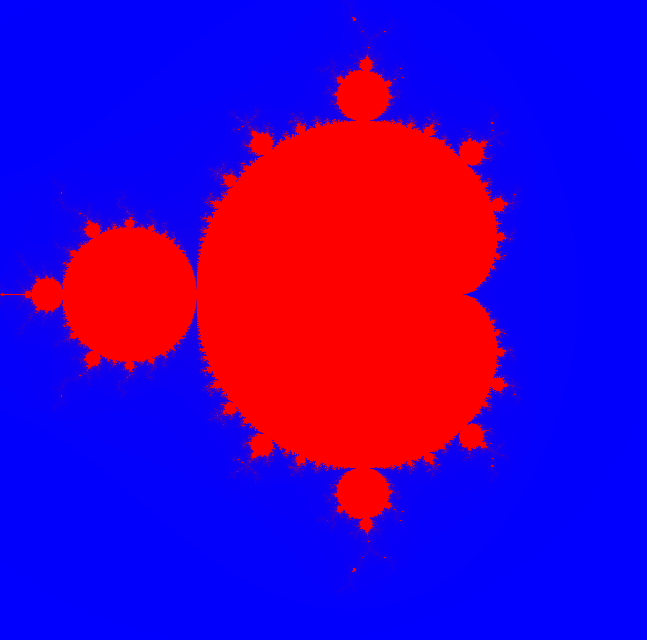

1. define height and width of the image   
2. define complex plane bounds (xmin = -1.5 and xmax = 1.5, ymin = -1.5, ymax =1.5 )  
3. Max iterations = 200  
4. Device function Julia input x,y, width and height, maps to (real,imaginary)
 run Julia fractal (z = z*z + c) until escape/max iteration, return iteration count  
5. Kernel function -> compute iteration count using the device function and assign colour.  
6. main function define the number of threads, grids and launch the kernel  

For the **Julia set**:

* Each pixel $z_0 = x + iy$ (based on pixel coordinates).
* $c$ = fixed constant (same for all pixels).
* Iterate $z_{n+1} = z_n^2 + c$.

For the **Mandelbrot set**:

* Each pixel $c = x + iy$ (based on pixel coordinates).
* Start with $z_0 = 0$.
* Iterate $z_{n+1} = z_n^2 + c$.

The **formula stays the same**, but you just swap which variable is fixed and which comes from the pixel.

---
**Summary Table:**

| Fractal Type   | Pixel ? Complex Value | Fixed Value        | Start $z_0$  |
| -------------- | --------------------- | ------------------ | ------------ |
| Julia Set      | $z_0 = x+iy$          | $c = \text{const}$ | $z_0 = x+iy$ |
| Mandelbrot Set | $c = x+iy$            | $z_0 = 0$          | $z_0 = 0$    |
The **iteration kernel** will look identical, but how you initialize **z** and **c** will differ.

